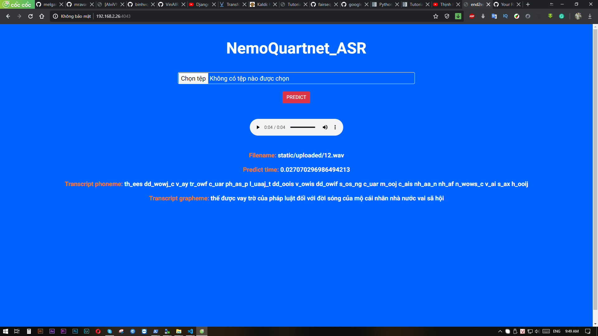

# nvidia-nemo-jasper-quartznet-asr-vietnamese
Nhận dạng giọng nói Tiếng Việt sử dụng model Quartznet (Nvidia) + flask demo  
Sử dụng đơn vị Âm vị (Phoneme) cho CTC loss và convert ngược lại Kí tự (Grapheme): https://github.com/dangvansam98/phoneme2grapheme-vietnamese 
model trained with 50h dataset(vivos, fpt, ...)  

